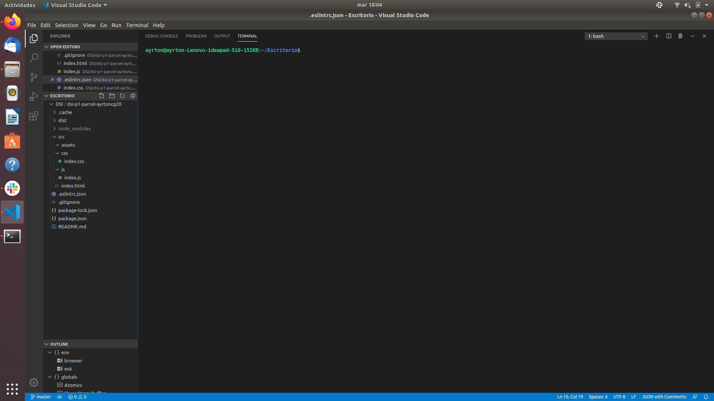
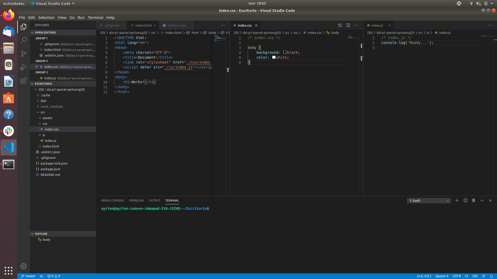
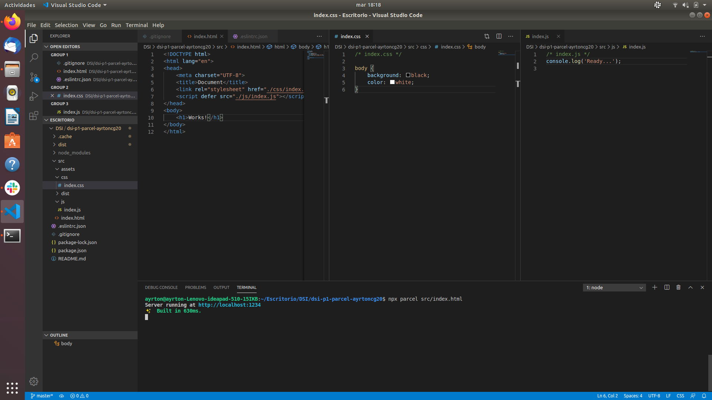
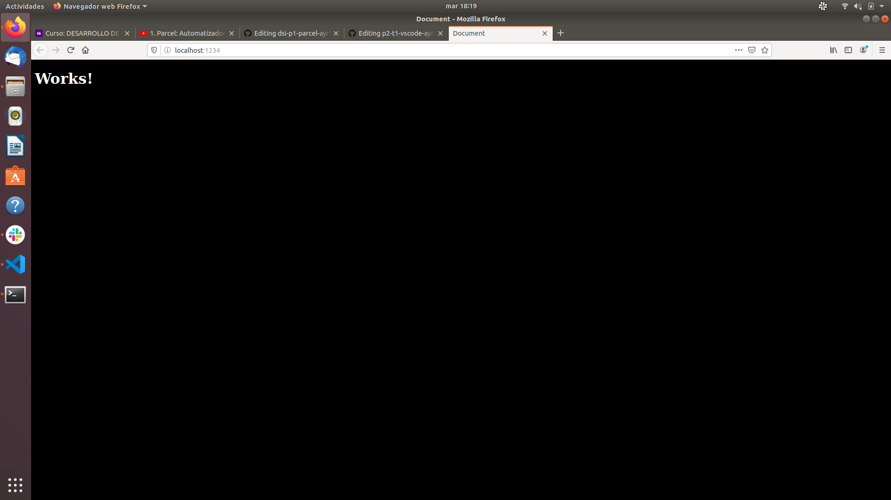
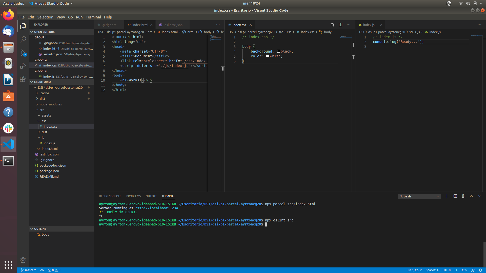
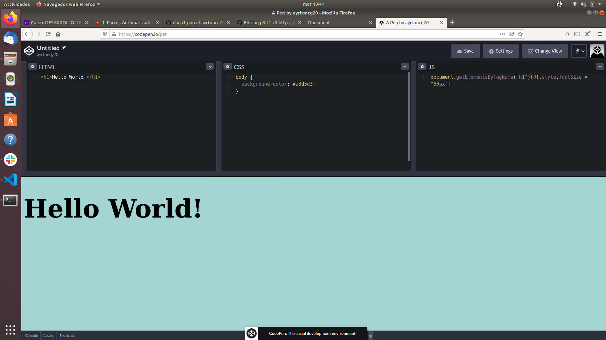
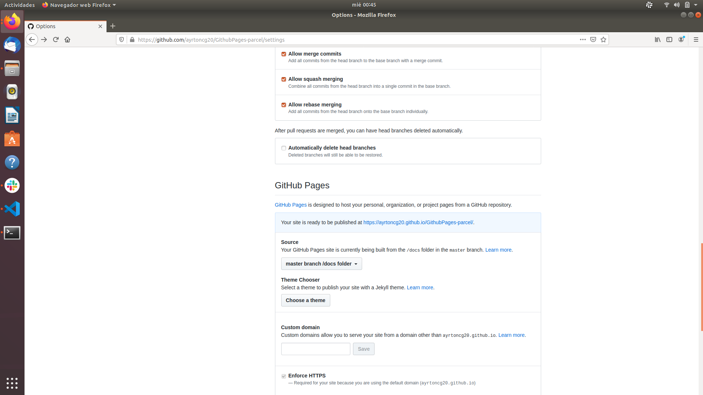
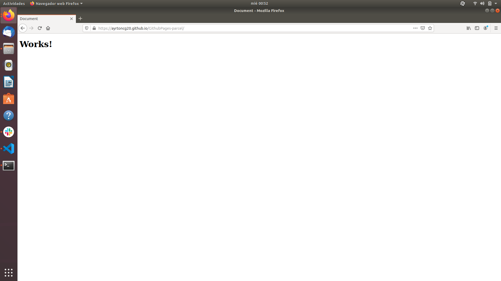

# dsi-p1-parcel-ayrtoncg20
p2-t1-vscode-ayrtoncg20 created by GitHub Classroom

## PRÁCTICA 1: dsi-p1-parcel-ayrtoncg20

## Comenzando

Como hemos visto en el video, necesitamos un sistema operativo linux, para ello tuve que crearme un linux desde 0, por lo que tuve que configurar todo lo relacionado con github. 

Lo primero que hice fue instalar el comando curl para poder instalar node. Una vez instalado node comprobamos la version de node de npm y de npx y estaban bien instaladas. 

Lo siguiente que hice fue instalar slack, como dice en el video, para poder interactuar con el profesor y con las dudas de los otros alumnos. 

También como era un linux totalmente nuevo tuve que instalar visual studio code.

En el slack acepté la tarea de la práctica uno por lo que asi ya teníamos acceso al repositorio.

Cree una carpeta DSI

Dentro de la carpeta DSI tenemos nuestra carpeta del proyecto que se llama dsi-p1-parcel-ayrtoncg20

Dentro de la carpeta del proyecto creamos la carpeta src y dentro la carpeta js, css y assets, que es donde irán los diferentes códigos. 




Cree el repositorio dentro de la carpeta del proyecto. 

A continuación lo que hice fue instalar parcel con el comando:

```
$ npm install -D parcel-bundler 
```

Instalamos parcel en nuestro proyecto por lo que cuando tengamos otro proyecto vamos a tener que instalar parcel nuevamente.

Para comprobar la versión de parcel utilizamos el comando:

```
$ npx parcel --version
```

Después de todo esto, cree los ficheros index.html, index.js e index.css.



Inicializamos el servidor para comprobar que todo funciona

```
$ npx parcel src/index.html
```




Comprobamos que exactamente el código funciona bien porque sale lo que queremos por el navegador



Para comprobar fallos en el código instalamos eslint y prettier. Tenemos que configurar tanto eslint como prettier para que trabajen a la vez sin problema. 

En la siguiente imagen comprobamos que no tenemos errores en el código, porque ya los había corregido, tuve problemas de punto y coma al final, de comillas dobles en vez de simples y necesitaba una línea extra al final del código. Los he corregido y por eso en la siguiente imagen no sale ningun error. 




En cuanto a la configuración de eslint y prettier puse que permitiera punto y coma al final aunque en javascript no hace falta yo tambien estoy acostumbrado a programar con punto y coma por lo que he modificado el archivo. 

En el siguiente fichero modificamos el eslint para que por ejemplo sepa que vamos a poner punto y coma al final de la línea y no lo muestre como un error. 

```
$ code .eslintrc.json 
```

El comando

```
$ npx eslint src --fix 
```

corrige los errores automáticamente pero tenemos que configurarlo anteriomente para que lo haga, lo intentaré realizar para la segunda práctica.

Con el siguiente comando instalamos prettier

```
$ npm install -D prettier
```

También tuvimos que instalar dos plugin para que eslint y prettier funcionen a la vez correctamente. Con el siguiente comando lo instalamos:

```
$ npm install -D eslint-config-prettier eslint-plugin-prettier
```

a parte, de lo visto anteriormente también tenemos que hacer uso de github pages y de codepen, por ello he conectado github con Codepen como se ve en la siguiente imagen:





En el uso de github pages he creado un respositorio para la práctica 1 que es la de parcel. En la siguiente imagen se ven el URL donde se muestra nuestra página web y la página web en cuestión.







